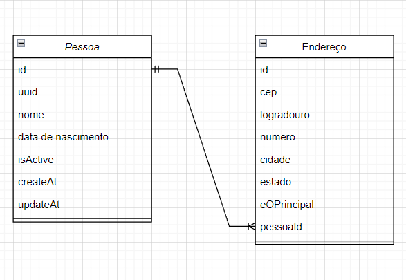

# Attus_Gerenciamento-pessoas_desafio

Os Arquivos Referentes aos três testes estão nas pastas separadas pelas etapas:

1. Pasta Teste 01: Refere-se a etapa 1 do teste;
2. Pasta Teste 02: Refere-se a redação da etapa 2;
3. Pasta Teste 03: Refere-se ao teste técnico da etapa 3;

# Referênte ao Teste 03

## Breve Introdução ao problema:

Durante o desenvolvimento desta aplicação, foram identificadas duas entidades principais: Pessoa e Endereço. Cada pessoa pode ter múltiplos endereços cadastrados, sendo apenas um deles designado como principal.

A decisão foi tomada de que o endereço principal seria o primeiro a ser cadastrado, simplificando assim o fluxo de informações na aplicação. Abaixo está o diagrama de classes utilizado para modelar o projeto:



Foi estabelecido um relacionamento de um-para-muitos entre as entidades (uma pessoa pode ter vários endereços). Os métodos das classes foram omitidos, pois consistem principalmente em getters e setters padrão, não havendo necessidade de métodos adicionais nessas classes.

Para a implementação da API, foram utilizadas as seguintes tecnologias:

- Java 21;
- Banco de dados H2, com testes também realizados no PostgreSQL 16;
- Framework Spring Boot 3.2.5.

Foi optado o uso do banco H2 para facilitar na avaliação da solução.

## Instruções 

Iniciar a aplicação no arquivo GerenciaPessoasApplication.java;

Acesso ao console do banco:

>http://localhost:8080/h2-console

Parâmetros do banco:
- user: pessoas;
- password: pessoas;

Acesso aos SWAGGER:

>http://localhost:8080/swagger-ui.html

Principais endpoints:

### Retorna a pessoa pelo seu uuid.
```
GET:http://localhost:8080/person/v1/{uuid}
```
### Parâmetros:

- uuid = uuid da pessoa que quer buscar;

### Edita dados da pessoa.
```
PUT:http://localhost:8080/person/v1/{uuid}
```
### Parâmetros:

- uuid = uuid da pessoa que quer editar;

### Corpo de Requisição:
```
{
  "name": "string",
  "birthday": "2024-05-05"
}
```

### Adiciona pessoa.
```
POST:http://localhost:8080/person/v1
```

### Corpo de Requisição:
```
{
  "name": "string",
  "birthday": "2024-05-05",
  "address": {
    "cep": "string",
    "publicPlace": "string",
    "number": 0,
    "city": "string",
    "state": "string"
  }
}
```

### Busca pessoas com o nome ou que contenham nome.
```
GET:http://localhost:8080/person/v1/list?name={name}
```
### Parâmetros:

- name = nome completo ou fragmento;

### Altera endereço da pessoa.
```
PUT:http://localhost:8080/address/v1/person/{uuid}/old-cep/{cep}
```
### Parâmetros:

- uuid = uuid da pessoa;
- cep = CEP cadastrado na plataforma;

### Corpo de Requisição:
```
{
  "cep": "string",
  "publicPlace": "string",
  "number": 0,
  "city": "string",
  "state": "string"
}
```

### Adiciona endereço a lista da pessoa, sempre sendo como não principal.
```
PATCH:http://localhost:8080/address/v1/person/{uuid}
```
### Parâmetros:

- uuid = uuid da pessoa;

### Corpo de Requisição:
```
[
  {
    "cep": "string",
    "publicPlace": "string",
    "number": 0,
    "city": "string",
    "state": "string"
  }
]
```

### Muda o endereço principal da pessoa.
```
PATCH:http://localhost:8080/address/v1/person/new-principal-cep/{cep}
```
### Parâmetros:

- uuid = uuid da pessoa;
- cep = CEP do endereço principal, que deve conter na lista dos endereços da pessoa.

### Busca lista de endereços da pessoa.
```
GET:http://localhost:8080/address/v1/person?uuid={uuid}
```

### Parâmetros:

- uuid = uuid da pessoa;

### Busca endereço da pessoa.
```
GET:http://localhost:8080/address/v1/person/{uuid}/address/{cep}
```

### Parâmetros:

- uuid = uuid da pessoa;
- cep = CEP que quer buscar na lista.

## Melhoramento:

Alguns pontos para um futuro melhoramento:

1. Adicionar uma classe para o tratamento de erros, não deixando os erros gerados deixem expor o uso do springboot para o usuário;
2. Elaboração de testes unitários para melhorar a robustes da aplicação;
3. Utilização de API externa para a validação do endereço das pessoas, como o via Cep;
4. Criação de um container docker para facilitar um futuro deploy;